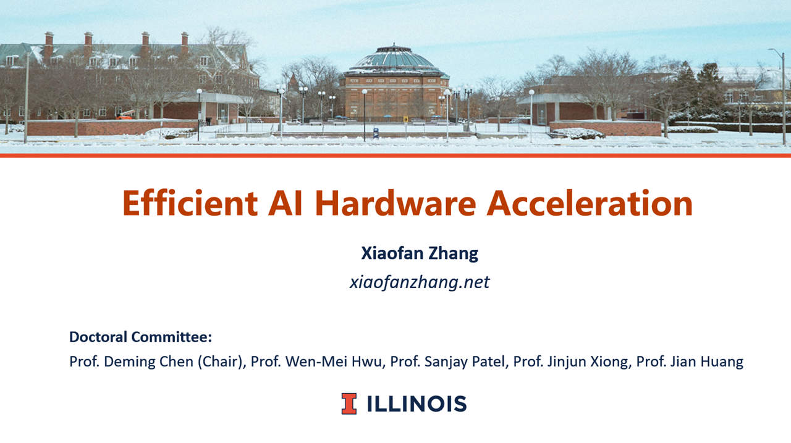
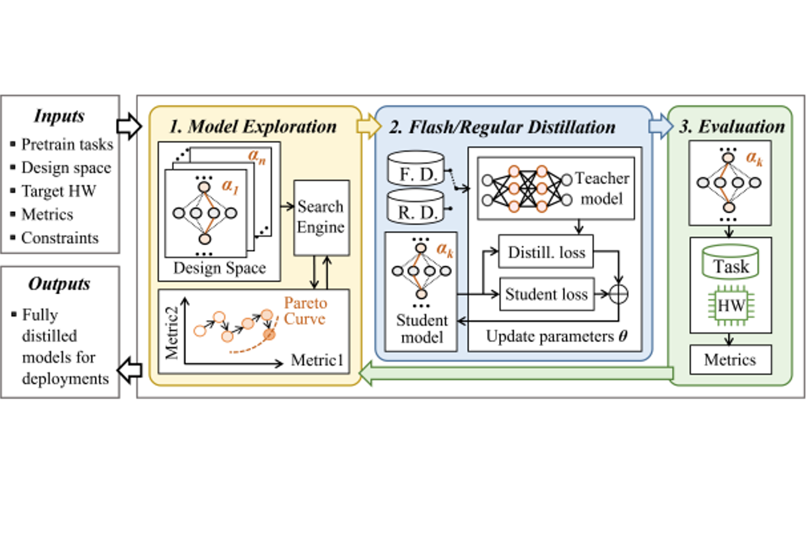
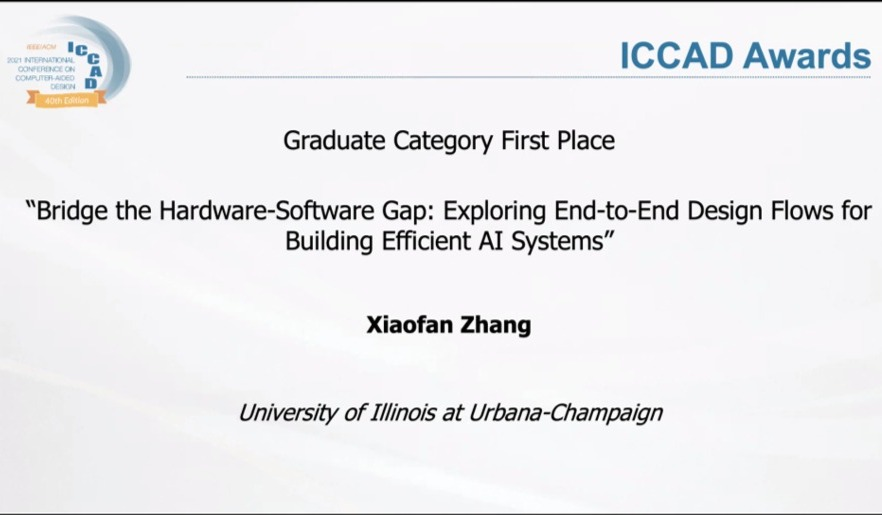

I work at Google on optimizing the TPU perforamnce of Gemini training and serving. My research interests include AI Systems, Energy-efficient Computing, and HW/SW Co-design.

Before joining Google, I was a [Google Ph.D. Fellow](https://grad.illinois.edu/news/xiaofan-zhang-csl-engineering-student-receives-2020-google-phd-fellowship) and a [Mavis Future Faculty Fellow](https://mavis.grainger.illinois.edu/) and I received my Ph.D. from the University of Illinois Urbana-Champaign (UIUC) in 2022. My advisor is [Prof. Deming Chen](http://dchen.ece.illinois.edu/) and I closely work with [Prof. Wen-mei Hwu](https://research.nvidia.com/person/wen-mei-hwu) and [Prof. Junjun Xiong](https://www.xlab-ub.com/). I received my B.S. and M.S. in UESTC, Chengdu, China.  

**[07/22] Successfully defended my PhD Thesis**

<picture>
 
</picture>

I have successfully defended my Ph.D. thesis! I am exceptionally grateful for receiving a lot of help and support from my advisors, colleagues, friends, and family over the years. My thesis *Efficient AI Hardware Acceleration* is available for open access.

 

[[Thesis](https://www.ideals.illinois.edu/items/126747)]
  

**[01/22] AutoDistill makes NLP models run efficiently on TPUv4i**

 

Our recent collaboration with Google proposes AutoDistill, an end-to-end model distillation and model architecture exploration framework for building hardware-aware NLP pre-trained models with BERT-level accuracy but 5X fewer parameters.
 

[[Paper](https://arxiv.org/pdf/2201.08539v1)]
  

**[11/21] Won the ACM Student Research Competition Winner Award**

 

I received the 1st place winner award of the [ACM Student Research Competition at ICCAD 2021](https://www.sigda.org/sigda-events/src/) by proposing three end-to-end design flows for building efficient edge and cloud AI systems. These flows are parts of my latest research including EcoSys (published in TCAD), F-CAD (published in DAC'21), and SkyNet (published in MLSys'20).
  

